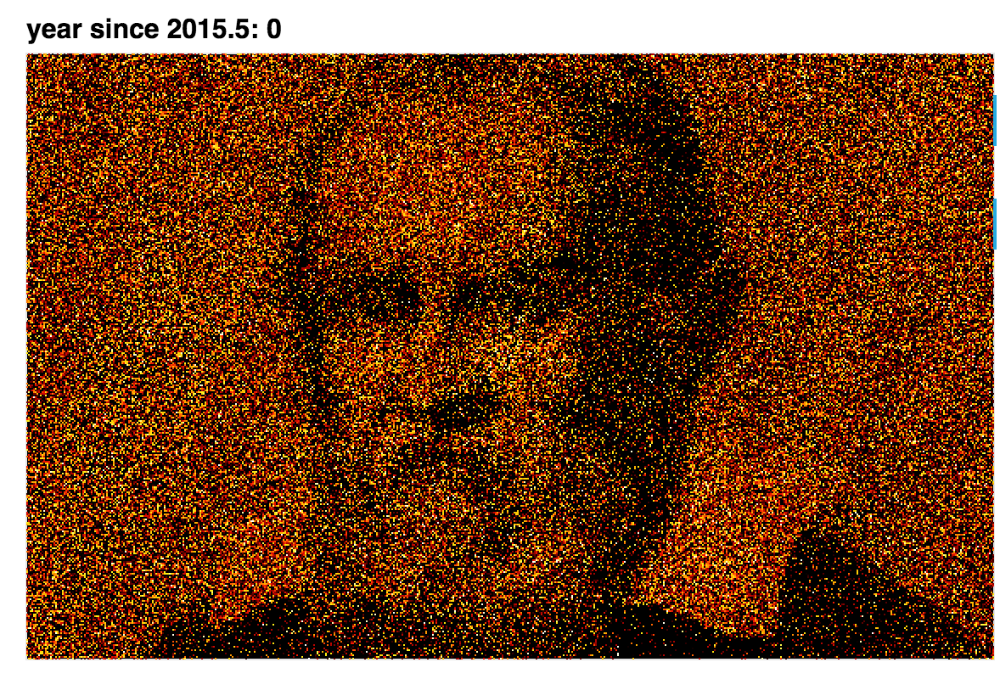

# gaiadr2_viz

Make constellation images (watch them come together and disappear in time):

See the [notebook](https://github.com/profjsb/gaiadr2_viz/blob/master/sky_image.ipynb).

Filter and zoom in on the RV sky:

See the [notebook](https://github.com/profjsb/gaiadr2_viz/blob/master/gaia_viz.ipynb).

